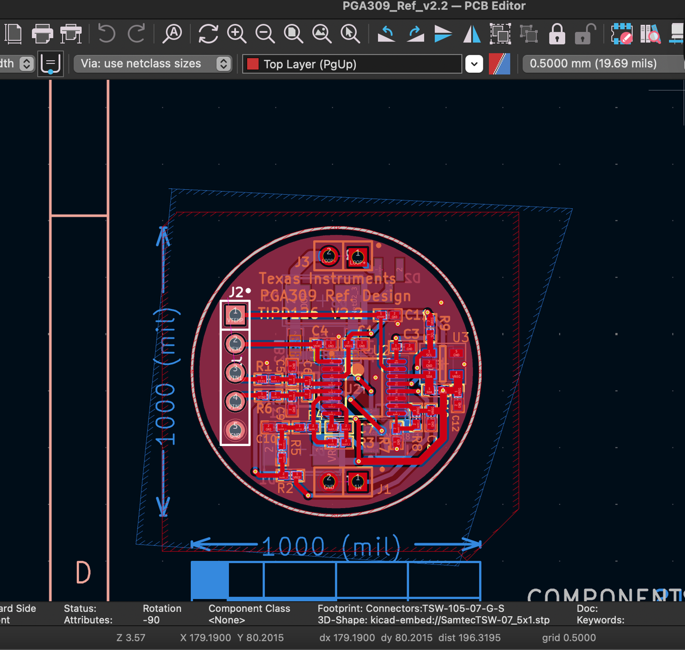

# Protel and Altium file format compatibility with KiCad

Which legacy **Protel** and **Altium** PCB file formats can be converted to
modern **KiCad**, how, and how well. Protel shipped a new board format roughly
every product generation and all of them use the `.PCB` extension, so the
extension tells you nothing - the header does.

This page is kept current. If you have a file that is not covered, see
[Contributing a sample](#contributing-a-sample).

## Quick answer

| Your file says | Written by | Convert with | Status |
|---|---|---|---|
| `PCB FILE 4` | Protel Autotrax | `protel-to-kicad` (this package) | **Full** |
| `PCB FILE 5` | Protel Easytrax | `protel-to-kicad` (this package) | **Full** |
| `PCB FILE 6 VERSION 1.10` / `2.70` / `2.80` | Protel PCB ASCII export | `protel-to-kicad` (this package) | **Full** |
| `PCB FILE 9 VERSION 2.70` | Protel for Windows / Advanced PCB | `protel-to-kicad` (this package) | **Full** |
| `\|RECORD=Board\|...` | Protel 98 / 99 / 99 SE, saved as PCB ASCII | `protel-to-kicad` (this package) | **Full** |
| `.ddb` design database | Protel 99 / 99 SE | `protel-to-kicad` (this package) | **Partial** - text documents only |
| `PCB FILE 9 VERSION 2.00` / `2.60` | Protel for Windows 2.x | nothing yet | Recognised, records differ |
| `PCB 4.0 Binary File` | Protel 98 / 99 / 99 SE | [save it as PCB ASCII](#protel-pcb-ascii---the-way-out-of-the-binary) | Recognised, not decoded |
| `PCB 3.0 Binary File` | Protel Advanced PCB 3 | nothing yet | Recognised, not decoded |
| `DOS 3 PCB` | Protel PCB for DOS | nothing yet | Recognised, not decoded |
| `.PcbDoc` (OLE compound file) | Altium Designer | **KiCad's own importer** | Full, built into KiCad |

### How to tell which one you have

```bash
head -c 40 YOURBOARD.PCB | strings | head -1
```

Or let this package answer:

```bash
python -c "from protel99_parser import formats; from pathlib import Path; \
print(formats.identify(Path('YOURBOARD.PCB')))"
```

### A correction, and what it was based on

Until 2026-09-17 this page named `PCB FILE 9 VERSION 2.70` the format of Protel
99 SE and `PCB FILE 6 VERSION 2.80` the format of "Protel for Windows / Protel
3". Both are wrong, and three independent sources say so:

- The **Protel for Windows 2.8 installer of 1995**, on archive.org, ships seven
  demo boards. They are `PCB FILE 9 VERSION 2.70`. Protel 99 SE was released in
  1999.
- The **Protel 2.04 install set**, older still, ships the same demo boards as
  `PCB FILE 9 VERSION 2.60`.
- Of **143 Protel 99 SE `.ddb` design databases** collected from 8 unrelated
  public repositories, zero contain the string `PCB FILE 9 VERSION`. 123
  contain `PCB 4.0 Binary File`.

And `PCB FILE 6` is not a product's native format at all. The vendor's own
`Protel 99 SE PCB ASCII File Format Reference` (2000) lists it as one of five
text export vintages:

| Vendor's name | How the file announces itself |
|---|---|
| PCB ASCII Version 4.0 (PCB99SE) | `KIND=Protel_Advanced_PCB\|VERSION=3.00` |
| PCB ASCII Version 3.0 (PCB3, PCB98, PCB99) | `KIND=Protel_Advanced_PCB\|VERSION=3.00` |
| PCB ASCII Version 2.8 | `PCB FILE 6 VERSION 2.80` |
| Autotrax / Easytrax | `PCB FILE 4` / `PCB FILE 5` |
| DOS 3 PCB | `DOS 3 PCB` |

Which is why `PCB FILE 6` exists in versions 1.10, 2.70 and 2.80: the export
tracked the product, not a redesign.

---

## Formats this package decodes

### `PCB FILE 4` and `PCB FILE 5` - Protel Autotrax and Easytrax

**Status: full.** Plain ASCII, whole mils, and the only Protel board formats
the vendor published a specification for. This reader is written from that
specification rather than from the files, and the test fixtures are the record
examples printed in it.

Easytrax differs from Autotrax only in not assigning hole sizes to pads, which
it writes as a zero in the same field, so one reader serves both.

Measured on 95 boards from public sources (2026-09-17): **95 parse, zero
salvaged records**, 4366 components, 101142 tracks, 31056 pads, 3930 vias.
Track and component totals were checked against an independent count of the
record tags in the raw files and matched exactly.

**Verified against gerbers the original program plotted.** Two of those boards
are published with the gerber set Traxplot wrote from them, which is a witness
this package cannot influence. For each, the pad and via breakdown was used to
predict how many flashes every copper layer should carry, then the flashes were
read out of the gerber and matched back to the board:

| Board | Predicted flashes per copper layer | Measured | Flashes further than 1 mil from a pad |
|---|---|---|---|
| `PCB_1` | 48 pads + 1 via = **49** | 49 top, 49 bottom | **0 of 49**, worst 0.000 mil |
| `Vac1b` | 103 pads + 35 vias = **138** | 138 top, 138 bottom | **0 of 138**, worst 0.000 mil |

Where the board is drawn is a property of the board; where the plot puts it is
a property of the plot, so the comparison allows one rigid transform and reports
which one fitted. `PCB_1` needed none. `Vac1b` needed a mirror in X - its plot
was made for film - and after it every one of the 138 flashes landed exactly on
a pad or a via.

`PCB_1`'s gerber is RS-274X, so it also names its apertures. The diameters it
declares are the pad sizes in the board file, to the digit: 52, 60, 62, 70 and
240 mil on both sides. `Vac1b`'s is RS-274D, which keeps its aperture table in
a separate wheel file, so sizes could not be compared there.

Two deviations from the published specification occur in real files and both
are read: tracks without their trailing `user-routed` flag (13406 of 101142)
and vias carrying one field more than the four documented.

**Board outline: layer 12 (Keep Out), not 11.** The specification names layer 11
"Board Layer", but across the 95 samples layer 11 appears in 3 files and
encloses all the copper in 2 of them, while layer 12 appears in 10 and encloses
all the copper in 7. Most Autotrax boards have no outline layer at all and
convert without an `Edge.Cuts`. Use `--outline-layer 29` to select the Board
layer instead.

Arcs are stored as a quadrant bitmask rather than angles - bit 0 is the upper
right quadrant, 15 is a full circle - and are converted to start and end
angles.

### `PCB FILE 6` - Protel PCB ASCII, versions 1.10 to 2.80

**Status: full.** Despite the name this format is **not binary** - the files
are plain ASCII, zero bytes outside 32..126 plus CR LF, measured across every
sample available. Records are a tag on its own line followed by operand lines.

Tags pair up by owner: `CT`/`FT` track, `CP`/`FP` pad, `CS`/`FS` text,
`CF`/`FF` fill, `CA`/`FA` arc, plus `FV` via and `NETDEF`. A `C*` object
belongs to the `COMP` most recently opened; an `F*` object stands alone.

Three things change between versions and all three are read from the file:

| | 1.10 | 2.70 and 2.80 |
|---|---|---|
| Coordinate unit | whole mils | 1/1000 mil |
| Continuation line after a track, arc or fill | none | one |
| Pad record | 12 fields, one size | 33 fields, a size per side |

Only the unit is keyed to the version number. A continuation line is swallowed
only when the next line is not itself a record tag, and the pad layout is
chosen by field count, so a vintage that splits the difference does not need a
new branch.

Verified twice over. On **21 boards published by nine unrelated parties**
(measured 2026-09-17) all 21 parse with zero salvaged records, including the
two version 1.10 boards that lost 388 records each before the version
differences above were handled. On **11 boards from a private archive**
(measured 2026-09-15) the file's own eight object counters agree on 9; the two
that do not are off by one text and by three records lost to byte damage.

Board outline: Protel layer 28 (Keep-Out), **not** 29. Override with
`--outline-layer` if your boards differ.

**Caveat worth stating plainly.** No sample of this format has come with a
gerber set or an ASCII export from another tool, so there is no witness
independent of the reader itself. Self-consistency is not accuracy. The
coordinate scale for 2.70 and 2.80 is inferred: vias read 51181 and mounting
pads 137795, which are 1.3 mm and 3.5 mm to five digits, and no other power of
ten puts a via near a millimetre. If you have a `PCB FILE 6` board **with** its
gerbers, that would settle it - see below.

### `PCB FILE 9 VERSION 2.70` - Protel for Windows / Advanced PCB

**Status: full.** Binary. Reads components with their own pad geometry, copper
on all layers, vias, arcs, fills, text, nets and the board outline. No
footprint library, no ASCII export, no ground-truth file.

The format is undocumented - it appears in no published Protel specification -
and was reverse engineered for this package. The byte-level specification is in
[`FORMAT.md`](FORMAT.md).

Verified against four independent witnesses:

| Witness | Result |
|---|---|
| Protel's own ASCII v2.70 export, two boards, all objects one to one | 100 % matched, median error 0.000 mil, all within 0.0009 mil |
| Gerbers Protel itself plotted, layer by layer | pads and vias within 1 mil, copper 100 %, every drill hit matched |
| KiCad's `pcbnew` loader reading the result back | positions within 0.0003 mil |
| The file's own object counters, 1178-board archive | 1170 clean, 8 salvaged from byte-level damage |

Board outline: Protel layer 29 (Mechanical 1).

The seven demo boards in the Protel for Windows 2.8 installer convert as well:
6 clean, 1 salvaged, the largest carrying 1128 components and 27007 tracks.

### Protel PCB ASCII - the way out of the binary

**Status: full.** This is the `|RECORD=...|` text format documented in the
vendor's `Protel 99 SE PCB ASCII File Format Reference`, and it matters for one
reason above all: **the binary that Protel 98, 99 and 99 SE write is not
decoded here, and this is the format those products export.**

If you have a board this package refuses:

1. Open the design in Protel.
2. **File > Save As**, and choose the PCB ASCII format.
3. Convert the result.

Every record is one line of `KEY=VALUE` pairs separated by `|`, so the file
names its own fields and nothing depends on their order. Layers are named
rather than numbered, which removes the guesswork the binary formats need.
Objects say which component and which net they belong to with `COMPONENT=` and
`NET=`.

Both value spellings in circulation are read: `10mil` as the editor writes it,
and ` 1.00000000000000E+0001mil` as the vendor reference prints it. A value in
millimetres is converted.

Only one complete board in this format has been found in public - inside a
`.ddb`, below - so the reader is tested against the vendor's own record
examples rather than against a corpus.

Board outline: Protel layer 29 (Mechanical 1) by default. Boards in this
format frequently draw it on a different mechanical layer; `--outline-layer`
takes the Protel number.

### `.ddb` design databases - partial

**Status: partial, and the limit is worth understanding before you try.**

A `.ddb` is the container almost every Protel 99 and 99 SE project is delivered
in. It is a Microsoft Jet (Access) database holding the whole design: boards,
schematics, libraries and netlists as stored documents. Jet is not decoded
here and does not need to be - every Protel document announces itself with a
header string, so documents are found where they lie and cut out.

A project is not a board, so start by looking inside it:

```bash
protel-to-kicad project.ddb --list
```

```
project.ddb: 2 documents
  [ 0] PCB ASCII board                       198638 bytes  reads
  [ 1] PCB 4.0 binary board                  460783 bytes  -
  [ *] Protel PCB ASCII text                        reads
  document names in the database, order not matched to the list above:
    xd.pcb, Backup of xd.pcb, 3D xd.pcb, xd.DRC
```

Then take one:

```bash
protel-to-kicad project.ddb --document 0 -o board.kicad_pcb
protel-to-kicad project.ddb -o board.kicad_pcb     # the largest board in it
protel-to-kicad --batch projects/ out/             # every board in every .ddb
```

`--document` takes an index from `--list` or a piece of a format name
(`--document autotrax`). A batch run writes every readable board in a database,
suffixed `-0`, `-1` and so on when there is more than one, because converting
only the first would silently drop the rest.

**Document names are listed but not paired with the documents.** Protel keeps
its document table in plain text, so the names are readable; matching a name to
a stored blob needs the Jet table structure, which is not decoded. Guessing the
pairing would put a confident wrong name on a converted board.

What comes out: boards stored as **PCB ASCII**, or as **`PCB FILE 4`, `5`, `6`
or `PCB FILE 9`**. What does not: a board stored as **`PCB 4.0 Binary File`**,
which is most of them.

When nothing comes out, the message says which of two different things
happened, because they call for different next steps:

```
project.ddb: the board documents inside are in a format that is not decoded
yet. Contents: 53 x PCB 4.0 binary board, 15 x schematic. Open the project in
Protel and save the board as PCB ASCII

drawings.ddb: no board document inside - this database holds 8 x schematic.
This package converts boards; schematics and libraries are out of scope
```

Measured on 147 public `.ddb` files (2026-09-17): 16 yielded a board. The
database writes its own page headers straight through the document stored
inside it, so 10 of those 16 lost records to salvage - each one reported with
its line number.

Schematics are out of scope for this package, which converts boards.

---

## Formats recognised but not decoded

These are identified by header, named in error messages, and skipped by batch
runs with a count rather than in silence.

### `PCB FILE 9 VERSION 2.00` and `2.60`

**Status: recognised, records differ.** These are the same serialisation stream
as 2.70 in the parts that carry copper - relaxing the version check reads their
tracks and vias at plausible counts, 7323 against 7362 on one board that exists
in both vintages - but the component and text records carry two fields fewer
and no rotation string, so everything after the first component
desynchronises. The reader refuses rather than producing a board with no
components in it.

This is the most tractable undecoded format here, because **the same demo
boards ship in both 2.60 and 2.70**: the Protel 2.04 and Protel for Windows 2.8
install sets are both on archive.org. A field that moved can be found by
comparing one against the other rather than by guessing.

### `PCB 4.0 Binary File` - Protel 98 / 99 / 99 SE

**Status: not decoded.** This is the binary inside most `.ddb` files, so it is
the format that matters most and the one without a route. What is known:

- About 24 % of the file is readable ASCII in `KEY=VALUE|` form - the same
  record vocabulary the PCB ASCII reference documents field by field, which is
  the most promising way in.
- The binary remainder is divided into named sections, each introduced by the
  same `[length][ascii]` primitive the rest of the family uses: `Nets`,
  `Components`, `Polygons`, `FromTos`, `Embeddeds`, `Arcs`, `Pads`, `Vias`,
  `Tracks`, `Texts`, `Fills`, `Violations`.
- Coordinates are `int32` little-endian in **1/10000 mil**, the same scale as
  `PCB FILE 9`.
- The record layout is **not** solved. Coordinates are interleaved with other
  fields rather than adjacent, so a scan for consecutive coordinate runs finds
  nothing and no constant record stride has been established.

Until it is, [saving as PCB ASCII](#protel-pcb-ascii---the-way-out-of-the-binary)
is the route.

### `PCB 3.0 Binary File` and `DOS 3 PCB`

**Status: not implemented.** Recognised by header. One sample of the first has
been seen; none of the second.

---

## Altium `.PcbDoc` - use KiCad directly

**You do not need this package.** KiCad has shipped an Altium board importer
for years. In the GUI: **File > Import > Non-KiCad Board File**.

From Python, using KiCad's own interpreter:

```python
import pcbnew
board = pcbnew.PCB_IO_MGR.Load(pcbnew.PCB_IO_MGR.ALTIUM_DESIGNER, "board.PcbDoc")
pcbnew.PCB_IO_MGR.Save(pcbnew.PCB_IO_MGR.KICAD_SEXP, "board.kicad_pcb", board)
```

KiCad's importer also covers `ALTIUM_CIRCUIT_STUDIO`, `ALTIUM_CIRCUIT_MAKER`,
`PCAD`, `EAGLE`, `CADSTAR_PCB_ARCHIVE`, `EASYEDA`, `FABMASTER` and others.



*A Texas Instruments PGA309 reference design, `.PcbDoc` imported into KiCad's
PCB Editor by KiCad's own Altium importer - the route this table recommends for
that generation. Not produced by this package.*

Verified on that board (measured 2026-09-15). Pads were broken down by type in
the imported board to predict how many flashes each copper layer should carry,
then compared against the gerbers the original toolchain plotted years earlier:

| | predicted from the import | measured in the original gerbers |
|---|---|---|
| top flashes | 63 SMD + 9 through + 22 vias = **94** | **94** |
| bottom flashes | 25 SMD + 9 through + 22 vias = **56** | **56** |

**Known failure.** One `.PcbDoc` sample makes KiCad 9's importer throw an
`IO_ERROR` that is not caught across the SWIG boundary, aborting the process
(exit code 134) rather than raising a Python exception. The file is a valid OLE
compound document with the same signature as files that import cleanly. If you
hit this, try the GUI importer - it is a different code path - and report the
file to KiCad, not here.

### What about Autotrax in KiCad?

KiCad has an Autotrax importer on its development branch. It is **not** in
KiCad 9.0 or 8.0 - checked against an installed 9.0.8, whose `PCB_IO_MGR` lists
no Autotrax backend - so it is not a route available today.

---

## Schematics

Out of scope for this package, which converts boards. For the record, the
Protel schematic binary announces itself as
`Protel for Windows - Schematic Capture Binary File Version 1.2 - 2.0` and uses
the same `[length][ascii]` primitive. It is not decoded here.

---

## Contributing a sample

The gap between "recognised" and "decoded" is almost always a missing sample.
What helps, in order:

1. **A board plus the gerbers the original program plotted from it.** This is
   worth more than anything else: it is a witness written by the vendor's own
   software, so it can prove a decode right rather than merely self-consistent.
   It is what put a real accuracy figure on `PCB FILE 4` above.
   **`PCB FILE 6` needs this most** - it is the one format here with no
   independent witness at all, and no sample of it has yet turned up with its
   gerbers beside it.
2. **A board plus an ASCII export** of the same board from the original tool.
3. **A board alone.** Still useful - the object counters in the header make a
   real check - but it cannot establish accuracy.

Open an issue with the header line (`head -c 40 FILE.PCB | strings | head -1`)
and say which of the three you have. Do not attach files you are not free to
publish.

---

## Verification

```bash
# what this package claims to read, from the code rather than from this page
python -c "from protel99_parser import formats; \
[print(f.key, f.label, 'reads' if f.reader else 'recognises') for f in formats.FORMATS]"

# the header of a file in hand
head -c 40 FILE.PCB | strings | head -1

# whether the installed KiCad has an Autotrax backend
python -c "import pcbnew; print([n for n in dir(pcbnew.PCB_IO_MGR) if n.isupper()])"
```

Last verified: 2026-09-17.
